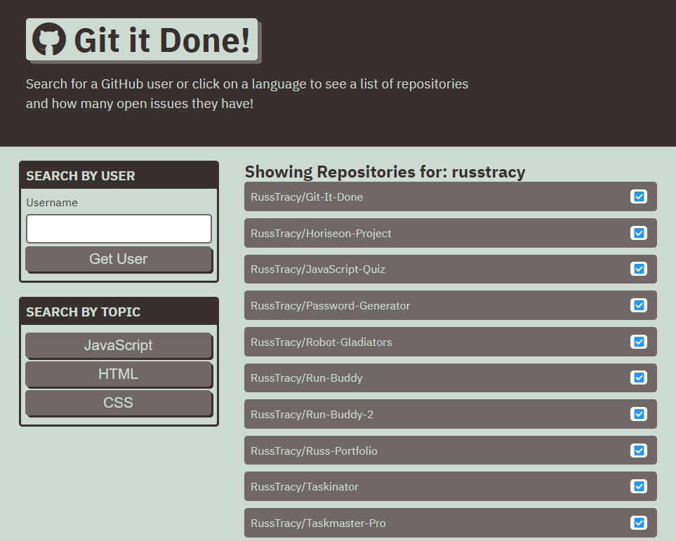

# Git-It-Done

Week 5: Third-Party API's Challenge

## Description

This site was designed to enhance my skills using Server-Side APIs.

## Built With
* HTML
* CSS
* BootStrap
* jQuery
* Moment.js

## Site Location
[Git It Done](https://russtracy.github.io/Git-It-Done/)

## Contribution
Made by [Russ Tracy]

## Site Image

### ©️2020 Russ Tracy
